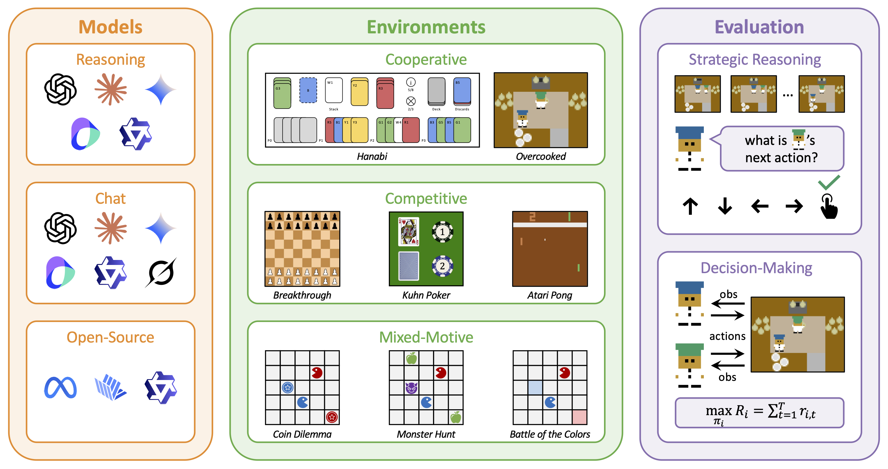

<h1 align="center">VS-Bench: Evaluating VLMs for Strategic Reasoning and Decision-Making in Multi-Agent Environments</h1>

<p align="center">
  <a href="https://vs-bench.github.io">Website</a> |
  <a href="https://arxiv.org/abs/2506.02387">Paper</a> |
  <a href="https://huggingface.co/datasets/zelaix/VS-Bench">Dataset</a>
</p>


## 📝 Overview



**Overview of the VS-Bench**.  VS-Bench is a multimodal benchmark for evaluating VLMs in multi-agent environments. We evaluate fourteen state-of-the-art models in eight vision-grounded environments with two complementary dimensions, including offline evaluation of strategic reasoning by next-action prediction accuracy and online evaluation of decision-making by normalized episode return.


## 📦 Installation
Setup a conda environment:
```bash
conda create -n vs-bench python=3.10 -y
conda activate vs-bench
pip install -r requirements.txt
```

## ⚡ Quickstart

To run a minimal example, first set the `OPENAI_API_KEY` environment variable using your own OpenAI API key:

```bash
export OPENAI_API_KEY=<your_api_key>
```

Next, you can run the following command to evaluate the decision-making ability of GPT-4.1 in the Tic-Tac-Toe environment:

```bash
python main.py --eval decision-making --exp tic_tac_toe
```

The results of this experiment, including the episode returns, images of each step in the match, and GPT-4.1's responses, will be saved in the `./results/decision-making` directory.


## 🚀 Experiments

Our evaluation considers two dimensions: decision-making and strategic reasoning.

### Decision-Making

To evaluate decision-making ability, run the following command:
```bash
python main.py --eval decision-making --exp <exp_name>
```
Replace `<exp_name>` with one of the experiment name provided in the `./configs/exp_configs` directory.

The default configuration file for each `<exp_name>` is located at `./configs/exp_configs/<exp_name>.yaml`. Below is the configuration file for Tic-Tac-Toe:

```yaml
experiment:
  name: default
  seed: 0
  async_mode: true
  num_episodes: 10
  results_dir: results

environment: tic_tac_toe

agents:
  - type: prompt_agent
    params:
      model: gpt-4.1
      visual_obs: true

  - type: mcts_agent
```
By default, the VLM is set to GPT-4.1. To use a different VLM, change the model parameter in the configuration file. All available VLMs can be found in the `./configs/model_configs/` directory.

We offer two different VLM agent types:
- `prompt_agent` (let the VLM only output the action)
- `cot_agent` (let the VLM think step by step)

Additionally, to compare VLM performance with traditional algorithms, we provide three baseline agents:
- `random_agent`
- `mcts_agent` (for board games)
- `cfr_agent` (for card games)


### Strategic Reasoning

We provide 400 samples for each environment to test VLMs’ strategic reasoning ability. You can download the VS-Bench dataset from [Hugging Face](https://huggingface.co/datasets/zelaix/VS-Bench) and place it in the `./data/` directory.

Next, run the following command to evaluate strategic reasoning:
```bash
python main.py --eval strategic_reasoning --exp <exp_name>
```
Replace `<exp_name>` with one of the environment name provided in the `./configs/env_configs` directory.


## 📚 Citation
```
@article{xu2025vs,
  title={VS-Bench: Evaluating VLMs for Strategic Reasoning and Decision-Making in Multi-Agent Environments},
  author={Xu, Zelai and Xu, Zhexuan and Yi, Xiangmin and Yuan, Huining and Chen, Xinlei and Wu, Yi and Yu, Chao and Wang, Yu},
  journal={arXiv preprint arXiv:2506.02387},
  year={2025}
}
```
